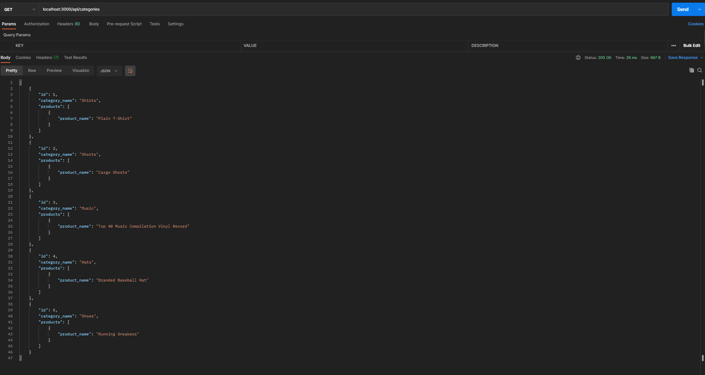

# E-Commerce  
  
  
  ## Description:  
  An E-Commerce back-end that compiles categories, tags, and products for items. The items can be viewed, created, updated, and deleted.

  ## Table of Contents:  
  - [Description](#-description)
  - [Table of Contents](#-table-of-contents)
  - [Installation](#-installation)
  - [Usage](#-usage)
  - [License](#-license)
  - [Contributing](#-contributing)
  - [Tests](#-tests)
  - [Questions](#-questions)

  ## Installation:  
  1. go to the Github repo. 2. Clone the repo. 3. install the dependencies. 4. Copy Schema code and run on mysql 5. Populate environment variables. 6. Seed data with npm run seed. 7. run with node server.js

  ## Usage:  
  Run program, and search on a broswer or an application using http://localhost:3000/api.
  
  ## License:  
  Licensed under [MIT](./LICENSE)
  
  ## Contributing:  
  This was a solo project by Wells Wu. Dependencies required: express, dotenv, mysql2, and sequelize.
  
  ## Tests:  
  updating and creating a api/database for an E-commerce store.

  
  
  ## Questions:  
  Contact Me: [Github](https://gist.github.com/WellsWu4621), or Email Me @wellswu.dev@gmail.com  
  Repository Link [E-Commerce](https://github.com/WellsWu4621/E-Commerce)
  Walkthrough Video: [Link](https://drive.google.com/file/d/1MZ719cqEu9C0yOYgLmb5SHg4gqFMB0G2/view)

